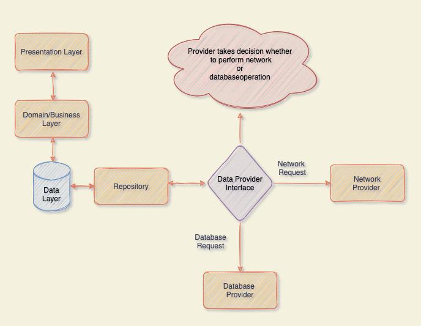

# Flutter Bloc

This repository contains all the basic/advanced example, which is covered in easiest way. 

Please find complete article on Medium [Link](https://medium.com/flutterworld/flutter-bloc-mystery-part-1-34c2d20cd092)

 

Don't forget to star⭐ and contribute if you want. 

# Output

 

# Requirements
- Any Operating System (ie. MacOS X, Linux, Windows)
- Any IDE with Flutter SDK installed (ie. Android Studio, VSCode etc)
- A little knowledge of Dart and Flutter
 

# Getting Started

This project is a starting point for a Flutter application.

A few resources to get you started if this is your first Flutter project:

- [Lab: Write your first Flutter app](https://flutter.io/docs/get-started/codelab)
- [Cookbook: Useful Flutter samples](https://flutter.io/docs/cookbook)

For help getting started with Flutter, view our 
[online documentation](https://flutter.io/docs), which offers tutorials, 
samples, guidance on mobile development, and a full API reference.
 
